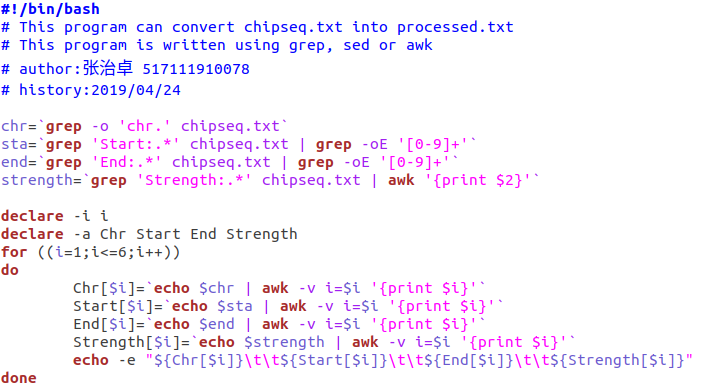
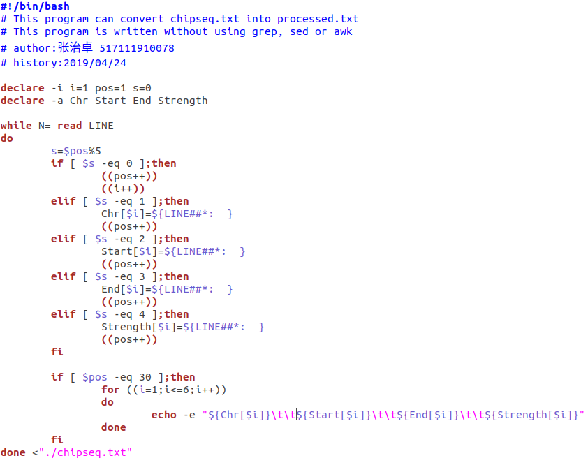
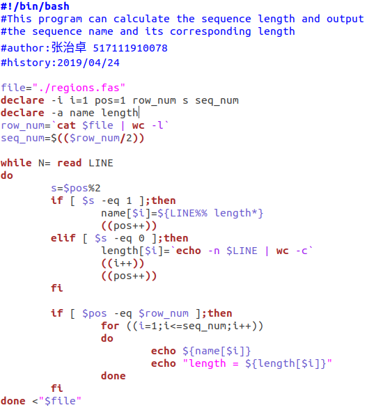
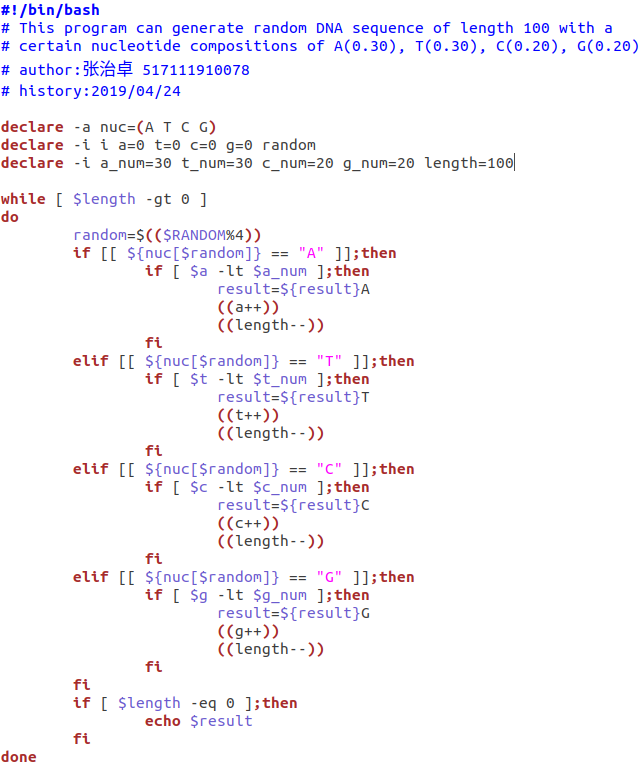
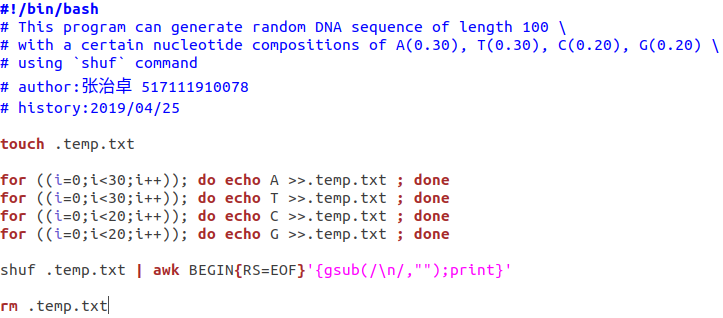
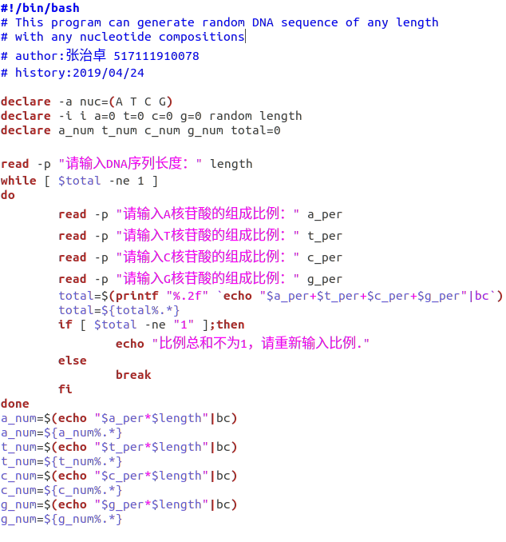
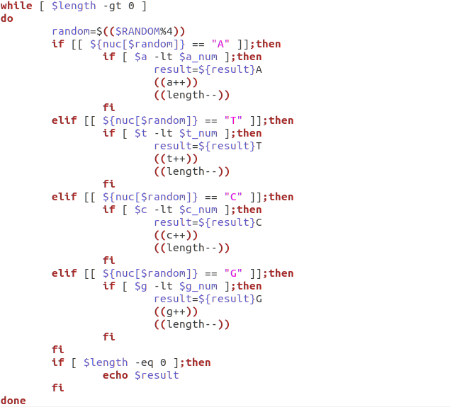
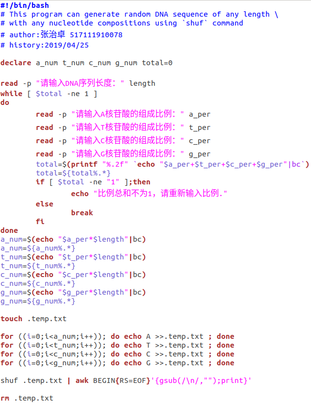
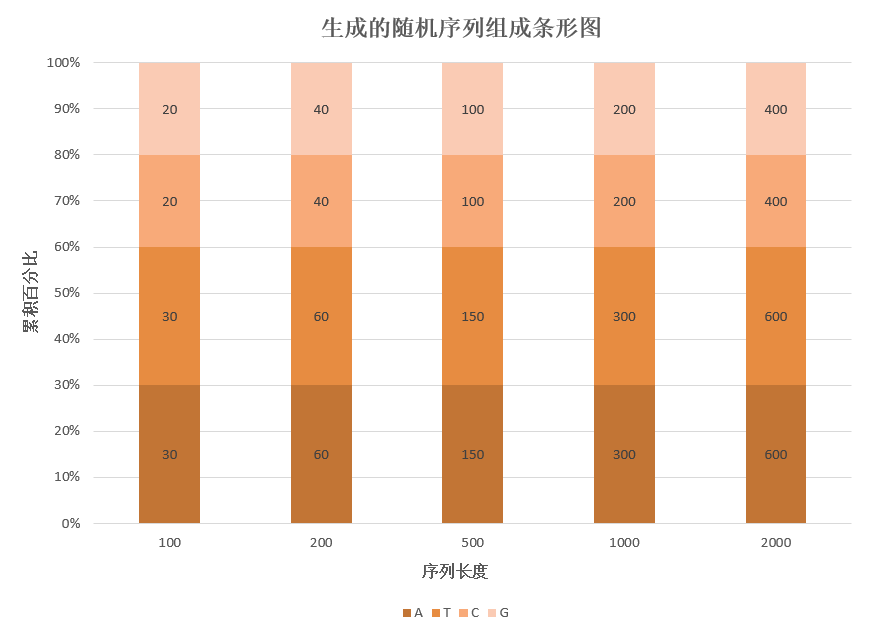

# Exercise 04: Bash
___

1. Convert [chipseq.txt](data/chipseq.txt) into [processed.txt](data/processed.txt)
**本题我用了两种方法，第一种使用了ｇｒｅｐ和ａｗｋ，第二种没有使用。
第一种代码如下**

**第二种方法代码如下**


2. Write a bash script to calculate the sequence length for each sequence in
[regions.fas](data/regions.fas). You should output the sequence name as well
as its corresponding length.
**代码如下，由于输出时显示过长，因此运行时重定向到新的txt文件中**


3. Summarize the usage of (), [], {} in bash.</li>
**1、单小括号 ()**
   ①命令组。括号中的命令将会新开一个子shell顺序执行，所以括号中的变量不能够被脚本余下的部分使用。括号中多个命令之间用分号隔开，最后一个命令可以没有分号，各命令和括号之间不必有空格。
   ②命令替换。等同于`cmd`，shell扫描一遍命令行，发现了$(cmd)结构，便将$(cmd)中的cmd执行一次，得到其标准输出，再将此输出放到原来命令。
   ③用于初始化数组。如：array=(a b c d)
**2、双小括号 (( ))**
   ①整数扩展。扩展计算整数型的计算，不支持浮点型。((exp))结构扩展并计算一个算术表达式的值，如果表达式的结果为0，那么返回的退出状态码为1，或者 是"假"，而一个非零值的表达式所返回的退出状态码将为0，或者是"true"。若是逻辑判断，表达式exp为真则为1,假则为0。
   ②只要括号中的运算符、表达式符合C语言运算规则，都可用在$((exp))中，甚至是三目运算符。作不同进位(如二进制、八进制、十六进制)运算时，输出结果全都自动转化成了十进制。如：echo $((16#5f)) 结果为95 (16进位转十进制)
   ③单纯用 (( )) 也可重定义变量值，比如((a\++))
   ④常用于算术运算比较，双括号中的变量可以不使用$符号前缀。括号内支持多个表达式用逗号分开。
**3、单中括号 []**
   ①bash 的内部命令，[]和test是等同的。结构中的左中括号是调用test的命令标识，右中括号是关闭条件判断的。这个命令把它的参数作为比较表达式或者作为文件测试，并且根据比较的结果来返回一个退出状态码。
   ②test和[]中可用的比较运算符只有==和!=，两者都是用于字符串比较的，整数比较只能使用-eq，-gt这种形式。无论是字符串比较还是整数比较都不支持大于号小于号。
   ③字符范围。用作正则表达式的一部分，描述一个匹配的字符范围。
   ④在一个array 结构的上下文中，中括号用来引用数组中每个元素的编号。
**4、双中括号[[ ]]**
   ①[[是 bash 程序语言的关键字,[[ ]] 结构比[ ]结构更加通用。在[[和]]之间所有的字符都不会发生文件名扩展或者单词分割，但是会发生参数扩展和命令替换。
   ②支持字符串的模式匹配，使用=~操作符时支持shell的正则表达式。字符串比较时可以把右边的作为一个模式，而不仅仅是一个字符串，比如[[ hello == hell? ]]，结果为真。[[ ]] 中匹配字符串或通配符，不需要引号。
   ③使用[[ ... ]]条件判断结构，而不是[ ... ]，能够防止脚本中的许多逻辑错误。比如，&&、||、<和> 操作符能够正常存在于[[ ]]条件判断结构中，但是如果出现在[ ]结构中的话，会报错。
   ④bash把双中括号中的表达式看作一个单独的元素，并返回一个退出状态码。

4. Use some examples to describe the usage of the bash command `bc`.
**常用的运算：**
\+ 加法
\- 减法
\* 乘法
/ 除法
^ 指数
% 余数
**语法**
bc(选项)(参数)
**选项值**
-i：强制进入交互式模式；
-l：定义使用的标准数学库
； -w：对POSIX bc的扩展给出警告信息；
-q：不打印正常的GNU bc环境信息；
-v：显示指令版本信息；
-h：显示指令的帮助信息。
**例子**
**1、基础计算**
```
$ bc
2+3
5
```
**2、通过管道运算**
```
$ echo "15+5" | bc
20
```
**scale=n设小数位，n代表保留两位:**
```
$ echo 'scale=2; (2.777 - 1.4744)/1' | bc
1.30
```
**3、进制转换**
通过ibase，obase设定
```
$ echo "obase=2;$192" | bc
11000000
```
**4、内置函数**
```
$ echo "10^10" | bc
10000000000
$ echo "sqrt(100)" | bc
10
```
5. Write a bash program to generate random DNA sequence of length 100, and with nucleotide compositions: A(0.30), T(0.30), C(0.20), G(0.20) or whatever you want.
**本题我采用了两种方式。
第一种是每次随机产生AGCT中的一个并判断是否超过应有个数，最终结果满足题目要求，但序列最后可能会集中在某一个核苷酸上，对于这个可以使用shuf命令随机重排（类似第二个方法）。
第一种代码如下**

**第二种方法是预设好AGCT各自的个数并导入一个临时文件，使用shuf命令随机重排所有行，然后合并所有行，删除临时文件，输出序列结果。
第二种方法代码如下**

**除了这两种方法外，还可以利用随机数产生的近似均匀性，通过调节对应每个核苷酸不同的数字比例，来进行特定组成生生成，但是由于随机数产生并非完全均匀，因此我没有写这种方法。**
6. Generate the random sequences of length 200, 500, 1000, and 2000, with the same composition as above.
**本题我将上一题代码修改后，变为了可以主动输入序列长度以及四种核苷酸组成的脚本，因此只需要输入长度为200,500,1000,2000和相同组成就能符合本题要求。除此外可以随意设定这些参数输出相应的序列。
第一种方法代码如下**


**第二种方法代码如下**

7. Use histogram or barchart to test whether the random sequences are consistent with the preset composition.
**根据以上输出的随机序列，通过查找计算各个核苷酸个数后，制成条形图如下（两种方法均控制了四种核苷酸的比例，因此个数相同）**

